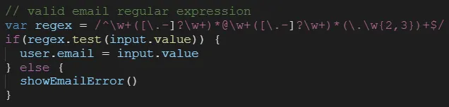
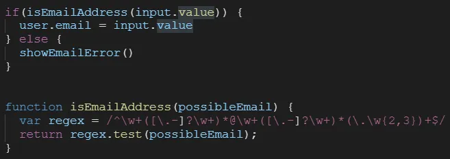

# Code Smell

**Code Smell** คือ การคำเปรียบเทียบวิธีการเขียนซอฟต์แวร์ (Software) ที่ดูแปลกและอาจนำไปสู่ปัญหาตามมา อีกทั้งยังมีรูปแบบที่ซับซ้อน โดยที่ Code Smell นั้นมีหลายประเภทแตกต่างกันออกไป

## แนวทางการจัดการเพื่อไม่ให้เกิด Code Smell

เพื่อให้โค้ดของเรามีคุณภาพและไม่มีอาการ Code Smell สามารถทำได้ดังนี้:

1. **Refactoring**: ปรับปรุงโครงสร้างโค้ดโดยไม่เปลี่ยนแปลงพฤติกรรมภายนอก
2. **Design Pattern**: นำรูปแบบการออกแบบซอฟต์แวร์ที่เหมาะสมเข้ามาช่วยจัดการโครงสร้าง
3. **SOLID Principles**: ปฏิบัติตามหลักการออกแบบซอฟต์แวร์ที่ดีเพื่อความยืดหยุ่นและบำรุงรักษาง่าย
4. **TDD (Test-Driven Development)**: ช่วยควบคุมคุณภาพตั้งแต่เริ่มต้น และอย่างน้อยที่สุดควรมี **Unit Test** ประกอบไว้เสมอ
5. **Code Review**: ใช้กระบวนการตรวจทานโค้ดร่วมกันในทีมเพื่อหาจุดบกพร่อง
6. **Code Scan**: ใช้เครื่องมือตรวจสอบโค้ดอัตโนมัติ เช่น **SonarQube** เพื่อช่วยค้นหาและ Fix Code Smell อย่างสม่ำเสมอ
7. **ประสบการณ์**: ใช้ประสบการณ์และความชำนาญสะสมในการเขียนโปรแกรมที่มีคุณภาพ

## ตัวอย่าง Code Smell

1. **Long Method**: เมธอดที่มีความยาวมากเกินไป
2. **Large Class**: คลาสที่มีความรับผิดชอบมากเกินไป
3. **Duplicate Code**: โค้ดที่ซ้ำกัน
4. **Long Parameter List**: เมธอดที่มีพารามิเตอร์มากเกินไป
5. **Feature Envy**: เมธอดที่เข้าถึงข้อมูลของคลาสอื่นมากกว่าคลาสของตัวเอง
6. **Data Clumps**: กลุ่มของตัวแปรที่มักจะปรากฏร่วมกัน
7. **Primitive Obsession**: การใช้ข้อมูลพื้นฐานแทนการสร้างคลาส
8. **Switch Statements**: การใช้คำสั่ง switch ที่ซับซ้อน
9. **Lazy Class**: คลาสที่ไม่มีความรับผิดชอบ
10. **Comments**: การใช้คอมเมนต์เพื่ออธิบายโค้ด

## Refactoring

**Refactoring** คือ กระบวนการปรับปรุงโครงสร้างโค้ดโดยไม่เปลี่ยนแปลงพฤติกรรมภายนอก เพื่อให้โค้ดอ่านง่าย บำรุงรักษาง่าย และขยายระบบได้ง่ายขึ้น

### หลักการสำคัญ

1. **ไม่เปลี่ยนพฤติกรรมภายนอก**: ระบบต้องทำงานเหมือนเดิม
2. **ทำทีละเล็กน้อย**: ทำทีละขั้นตอนเล็กๆ และทดสอบทุกครั้ง
3. **มี Test ที่ดีรองรับ**: ต้องมี Test ที่ครอบคลุมก่อนเริ่ม Refactor
4. **Code Review**: ให้เพื่อนร่วมทีมช่วยตรวจสอบ

### ประโยชน์ของการ Refactoring

1. **โค้ดอ่านง่ายขึ้น**: เข้าใจโครงสร้างและตรรกะได้ง่าย
2. **บำรุงรักษาง่าย**: แก้ไขข้อผิดพลาดได้ง่ายและรวดเร็ว
3. **ขยายระบบได้ง่าย**: เพิ่มฟีเจอร์ใหม่ได้โดยไม่กระทบส่วนอื่น
4. **ลด Code Smell**: กำจัด Code Smell ที่มีอยู่
5. **เพิ่มคุณภาพโค้ด**: ทำให้โค้ดมีคุณภาพสูงขึ้น
6. **ลดความซับซ้อน**: ลดความซับซ้อนของระบบ
7. **เพิ่มความยืดหยุ่น**: ทำให้ระบบยืดหยุ่นต่อการเปลี่ยนแปลง
8. **เพิ่มประสิทธิภาพ**: ในบางกรณีสามารถปรับปรุงประสิทธิภาพได้
9. **ลด Bug**: ลดโอกาสเกิดข้อผิดพลาด
10. **เพิ่มความเข้าใจ**: ช่วยให้ทีมเข้าใจระบบได้ดีขึ้น

## กรณีที่ Code Smell ไม่ได้บ่งบอกถึงโค้ดที่มีปัญหา (กรณีที่ไม่จำเป็นต้อง Refactoring)

ในบางสถานการณ์ การมี Code Smell อาจเป็นสิ่งที่ยอมรับได้หรือมีความจำเป็น ซึ่งไม่จำเป็นต้องทำการ Refactoring เสมอไป:

1. **Performance Optimization**: เมื่อต้องการประสิทธิภาพสูงสุด (Extreme Performance) การเขียนโค้ดที่ดูซับซ้อนหรือใช้เทคนิคพิเศษ (เช่น Bitwise operation) อาจจำเป็นกว่าความสวยงามของโค้ด
2. **Prototyping / Throwaway Code**: โค้ดที่เขียนขึ้นเพื่อทดสอบแนวคิดหรือใช้งานชั่วคราว (Draft) ซึ่งจะถูกลบทิ้งในภายหลัง ไม่คุ้มค่าที่จะเสียเวลาขัดเกลา
3. **Third-party / Generated Code**: โค้ดที่สร้างโดยเครื่องมืออัตโนมัติ (Code Generator) หรือ Library ภายนอกที่เราไม่ได้เป็นเจ้าของ ไม่ควรแก้ไขด้วยตนเอง
4. **Time & Cost Constraints**: หากโค้ดทำงานถูกต้อง มีความเสถียร และอยู่ในส่วนที่ไม่มีการแก้ไขบ่อยครั้ง การ Refactor อาจไม่คุ้มค่าเมื่อเทียบกับความเสี่ยงและเวลาที่เสียไป
5. **Simplicity Over Complexity**: ในบางกรณี การใช้โครงสร้างง่ายๆ อย่าง `Switch-Case` หรือ `If-Else` อาจจะทำความเข้าใจได้ง่ายกว่าการเปลี่ยนไปใช้ Design Pattern ที่ซับซ้อนเกินไป (Avoid Over-engineering)

## ตัวอย่าง Code Smell ของ Comment



## ตัวอย่าง Code Smell หลังแก้ไขด้วย Refactoring



### ตัวอย่างการใช้ Comment ที่ "ไม่จำเป็นต้อง Refactor"

แม้คอมเมนต์ส่วนใหญ่จะถูกมองเป็น Code Smell แต่ในกรณีเหล่านี้คอมเมนต์ยังมีความสำคัญ:

*   **Legal Comments**: คอมเมนต์ระบุลิขสิทธิ์ สัญญาอนุญาต (License) หรือข้อมูลทางกฎหมาย
    ```javascript
    /*
     * Copyright (c) 2024 Your Company.
     * Licensed under the MIT License.
     */
    ```
*   **Explanation of "Why"**: เมื่อโค้ดไม่สามารถอธิบายเหตุผลทางธุรกิจ (Business Logic) หรือความจำเป็นบางอย่างได้
    ```python
    # ใช้สูตรคำนวณภาษีปี 2567 ตามประกาศกรมสรรพากร (เลขที่ ม. 123)
    # เนื่องจากมีความจำเป็นทางกฎหมายที่ต้องใช้เรทพิเศษสำหรับอุตสาหกรรมนี้
    def calculate_special_tax(income):
        return income * 0.0325
    ```
*   **Warning of Consequences**: เตือนเรื่องผลกระทบหากแก้ไขโค้ดส่วนนี้ หรือเหตุผลที่เลือกใช้วิธีที่ดูไม่ปกติ
    ```javascript
    // (!) คำเตือน: ห้ามเปลี่ยนค่าลูปนี้เป็นแบบ Parallel 
    // เพราะ Database Legacy ของเราไม่รองรับ Concurrent Session เกิน 2 ตัว
    for (let i = 0; i < requests.length; i++) {
        processSync(requests[i]);
    }
    ```
*   **Workaround for External Bug**: อธิบายเหตุผลที่ต้องเขียนโค้ดแปลกๆ เพื่อแก้ปัญหาที่เกิดจาก Library ภายนอก
    ```csharp
    // วิธีแก้ปัญหาภาพแสดงผลเพี้ยนใน Chrome version 102
    // ดูรายละเอียดที่: https://github.com/external-library/issues/456
    ResetChromeBufferManually();
    ```

---

## สรุป

**Code Smell** ไม่ใช่ข้อผิดพลาด (Bug) ที่ทำให้โปรแกรมทำงานไม่ได้ในทันที แต่เป็นสัญญาณเตือนถึงปัญหาในเชิงการออกแบบและการบำรุงรักษาในระยะยาว การหมั่นตรวจสอบและทำ **Refactoring** อย่างสม่ำเสมอจะช่วยให้โค้ดสะอาด (Clean Code) และลดหนี้ทางเทคนิค (Technical Debt)

อย่างไรก็ตาม นักพัฒนาควรใช้ **วิจารณญาณ** ในการตัดสินใจ Refactor โดยคำนึงถึงบริบทของงาน ความคุ้มค่าทางเวลา และความจำเป็นทางเทคนิคประกอบด้วย เพื่อให้ได้ซอฟต์แวร์ที่มีคุณภาพและส่งมอบได้ตามกำหนดเวลา


